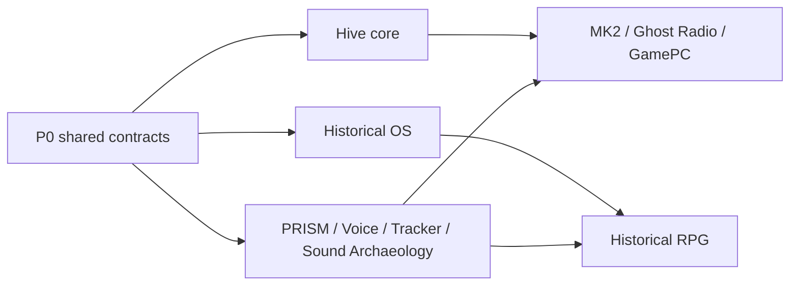

# AZOTH Project Portfolio

Status: active dependency ledger
Last reviewed: 2026-07-29

## The count

There are **20 primary resumable project lanes**, held today in **5 GitHub
repositories**, plus **12 candidate shared libraries** that need boundary review
before they are promoted to projects.

The count is deliberately not “one folder equals one project.” A primary lane
must have its own purpose, resume anchor, dependency list, and next gate. This
keeps a future session from mistaking generated output or an old experiment for
a maintained product.

The machine-readable source of truth is
[`PROJECT_PORTFOLIO.json`](PROJECT_PORTFOLIO.json). Its dependency graph is
checked by [`tools/validate_portfolio.py`](tools/validate_portfolio.py).

## Dependency order

| Priority | Meaning | Projects |
| --- | --- | --- |
| P0 | Shared contracts that unblock other work | Commons; provenance/status; device registry; interface/control contracts |
| P1 | Heart and reusable engines | Hive; PRISM; Voice; Historical OS; Sound Archaeology; Tracker/MOD |
| P2 | Products and independent tools built on P0/P1 | PiSynth; Muse; MPC tools; MK2; Ghost Radio; GamePC; media extract; Suno library |
| P3 | Later products with unresolved platform or rights gates | Historical RPG; ROM Scholar |

The Hive is the heart, but the heart should call stable contracts rather than
own every organ. PRISM and Voice already make sense independently. History is a
sibling knowledge system: it shares provenance and observer principles with the
Hive without becoming a Hive subfolder. The eventual RPG is a product of the
Historical OS and should become a sixth repository once its compiled-world
contract is stable.

## Current repository boundary

| Repository | Visibility | Primary responsibility |
| --- | --- | --- |
| `will-codeing` | Private | Integrated workshop, Hive, live hardware, rights-sensitive evidence, and not-yet-extracted projects |
| `azoth-commons` | Public | This sanitized ledger, standards, and contributor front door |
| `azoth-prism` | Public | Independent audio observation engine |
| `azoth-voice` | Private | Independent Voice Synth incubation |
| `east-texas-historical-os` | Private | Historical knowledge/processing architecture and Hallsville prototype |

“Private” is not a readiness judgment. It means the repository contains active
incubation or material whose rights/access boundary is not yet ready for public
use.

## How to resume any lane

1. Find its object in `PROJECT_PORTFOLIO.json`.
2. Open the named repository and `resume_anchor`.
3. Check every `depends_on` lane before implementing the `next_gate`.
4. Work on a branch and record tests, evidence, and owner-only verdicts
   separately.
5. Update the portfolio when a boundary, dependency, status, or next gate
   changes.
