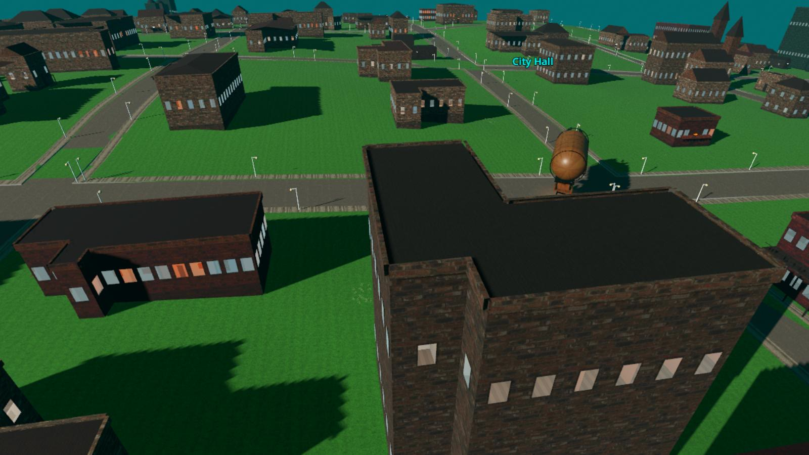
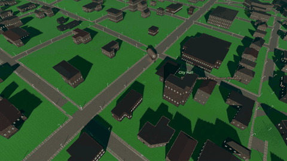
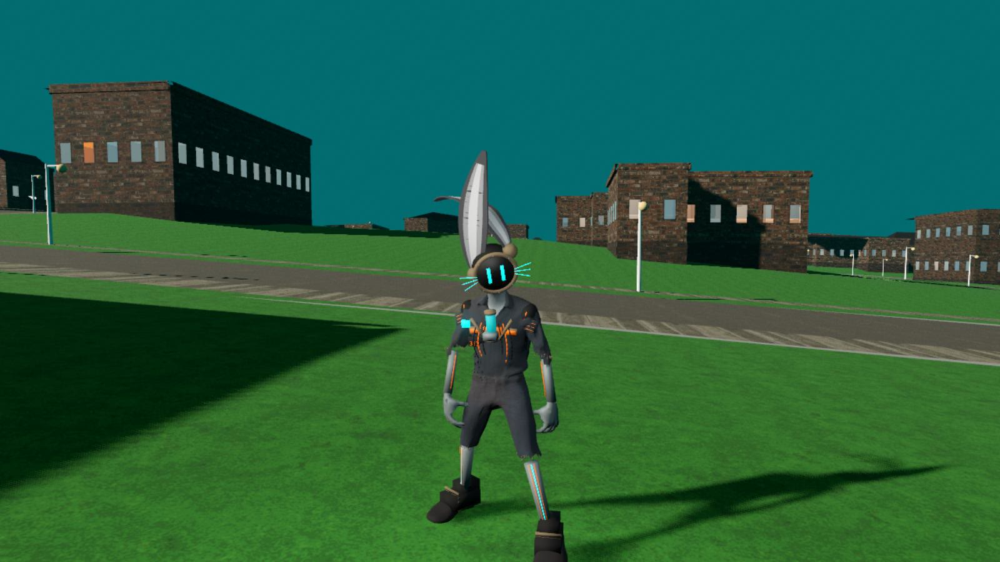
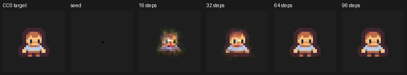

  

<h1 align="center">AZOTH</h1>

<b>A small world of AI citizens that make music, film themselves, and keep trying to get better.</b>

  <a href="#watch">Watch</a> ·
  <a href="#listen">Listen</a> ·
  <a href="docs/WHAT_IS_AZOTH.md">What is this?</a> ·
  <a href="docs/GALLERY.md">Gallery</a> ·
  <a href="docs/ROADMAP.md">Roadmap</a> ·
  <a href="docs/FAQ.md">FAQ</a> ·
  <a href="docs/HOW_TO_TAKE_PART.md">Take part</a>

---

## In one minute

AZOTH is a creative studio that runs on one home computer. Inside it lives **the Hive**: a society of AI
**citizens**, each with a name, a job, memories and opinions. They live in the **Hive City**, a 3D town wrapped around a
small planet that you can walk through like a game. The citizens write and play music as a band, film the City with a
moving camera, train tiny AI models of their own, and keep a written history of their world.

Everything they make gets the same question afterwards: *this is all right, but how could it be better?*

It is early and rough, and that is the point of showing it now: **you are watching a world learn how to become one.**

## Watch: Hive City Devlog 01 (60 seconds)

**[▶ Play the full video (MP4, 9 MB)](https://github.com/wruegg-cyber/azoth-commons/raw/main/media/hive_city_devlog_01.mp4)**.
It was filmed live inside the City by the City's own film mode, and scored by the Hive band.

## Listen: "EchoesVeil: Second Light" (2:01)

Written and performed by four Hive citizens: Petra Pitch (harmony), Elias Quill (melody), Vael (bass) and Jun Mercer
(drums). It has a verse-chorus-bridge song form, and its drums are built from real human drumming.

**[▶ Listen (MP3, 2.4 MB)](https://github.com/wruegg-cyber/azoth-commons/raw/main/media/echoesveil_second_light.mp3)** ·
credits in [CREDITS.md](CREDITS.md)

## What exists today (October 2026)

| | What works | Honest limits |
|---|---|---|
| **The Hive City** | A walkable 3D town on a cube planet, with districts, streets, day and night on real East Texas time | Simple buildings; much of the planet is still empty |
| **Citizens** | Named AI residents with jobs, memories and conversations | Most are still simple figures; one hero character, the Tube Hare, is being built in detail |
| **Music** | A four-member Hive band writes and renders full songs | Instrumental so far; mixing is basic |
| **Film** | The City films itself with scripted camera moves | Narration and following characters are next |
| **Self-grown models** | Small models the Hive trains itself: drum feel, a sprite grown from one seed, physics sense | Small and early; the physics model can't yet beat a simple formula |
| **The Chronicle** | A long written history of the City, keeping measured fact separate from legend | Ongoing |

See the [Gallery](docs/GALLERY.md) for more pictures, and the [Roadmap](docs/ROADMAP.md) for what comes next.

  
  

## Take part

- **Just curious?** Watch, listen, and leave a comment in **[Discussions](https://github.com/wruegg-cyber/azoth-commons/discussions)**. No coding needed.
- **Want to use something from AZOTH?** [Ask for permission here](https://github.com/wruegg-cyber/azoth-commons/issues/new?template=permission_request.yml).
- **Want to collaborate?** Say hello in Discussions. The full build is private, and collaborators are invited one at a time.
- New to GitHub? Read **[How to take part](docs/HOW_TO_TAKE_PART.md)**. It takes two minutes.

## What's public here

- This front door, with the videos, music, pictures and documents.
- **[AZOTH PRISM](https://github.com/wruegg-cyber/azoth-prism)**: an early audio-analysis toolkit taken out of AZOTH (AGPL-3.0).
- The Hive, the City and the production tools are developed privately and released in pieces as they mature.

## Licence and credit

The words, pictures, video and music in this repository are licensed **[CC BY-NC-SA 4.0](LICENSE)**: you can share and
adapt them **with credit**, **not commercially**, and **under the same licence**. How to credit: [LICENSE-DECISION.md](LICENSE-DECISION.md).
Third-party material used to make them is credited in [CREDITS.md](CREDITS.md). Everything not published here is
all rights reserved.

<b>For developers</b>

- [REPOSITORY_CATALOG.md](REPOSITORY_CATALOG.md): every AZOTH repository and its status
- [EXTRACTION_STANDARD.md](EXTRACTION_STANDARD.md): how a tool leaves the private workshop and becomes public
- [ACCESS_MODEL.md](ACCESS_MODEL.md): who can see and change what
- [CONTRIBUTING.md](CONTRIBUTING.md) · [SECURITY.md](SECURITY.md) · [GPT_START_HERE.md](GPT_START_HERE.md)

Installing the whole Hive yourself is not possible yet. It needs local AI models, the Godot engine and large free asset
libraries. A one-click installer is on the [Roadmap](docs/ROADMAP.md).

