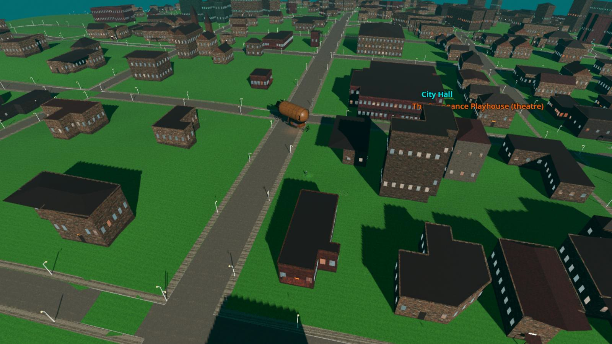
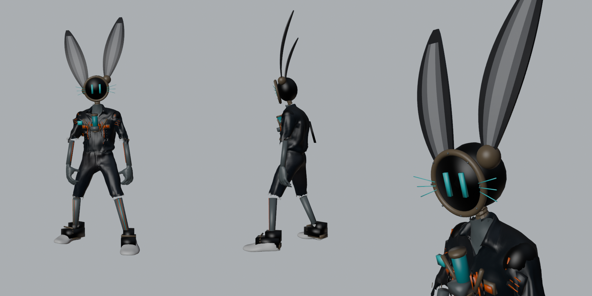
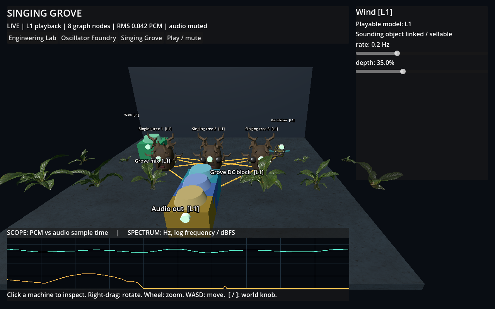

# Gallery

Work in progress, as it really looks today. Newest first.

## Hive City Devlog 01 (October 2026)
The City's first moving-camera film, shot live inside the City and scored by the Hive band.
[▶ Play (MP4)](https://github.com/wruegg-cyber/azoth-commons/raw/main/media/hive_city_devlog_01.mp4)

## The Tube Hare
The City's first detailed character: a rabbit built from salvaged parts, with a CRT-screen face, glowing whiskers and
long rabbit ears. Its walk, run and jump come from real motion capture.

## A sprite grown from one seed
One of the Hive's own small models: a "neural cellular automaton" that grows a citizen's picture from a single dot.
Damage it, and it grows back.

## Synth World: the Singing Grove (prototype)
A room where sound is something you can see: singing trees, a bee that strikes them, wind that moves them. Each object
is a real part of a synthesizer, wired together.

## Music: "EchoesVeil: Second Light"
[▶ Listen (MP3)](https://github.com/wruegg-cyber/azoth-commons/raw/main/media/echoesveil_second_light.mp3). A full
song by four Hive citizens.
